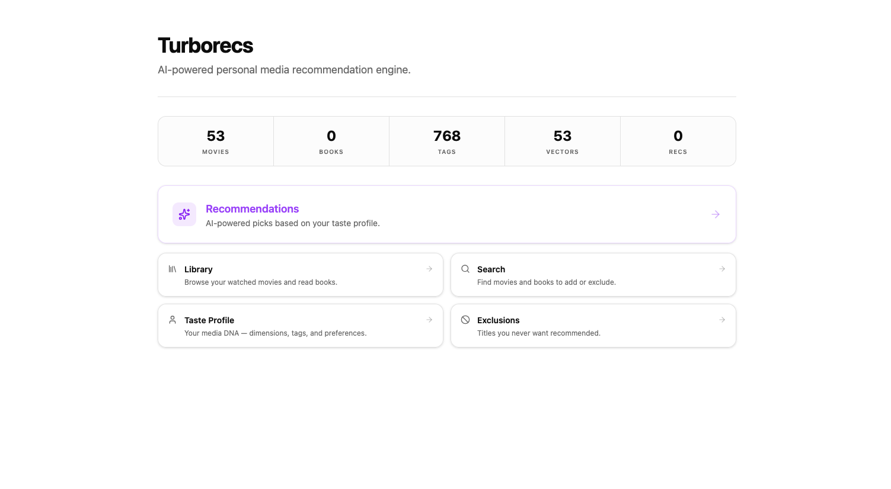
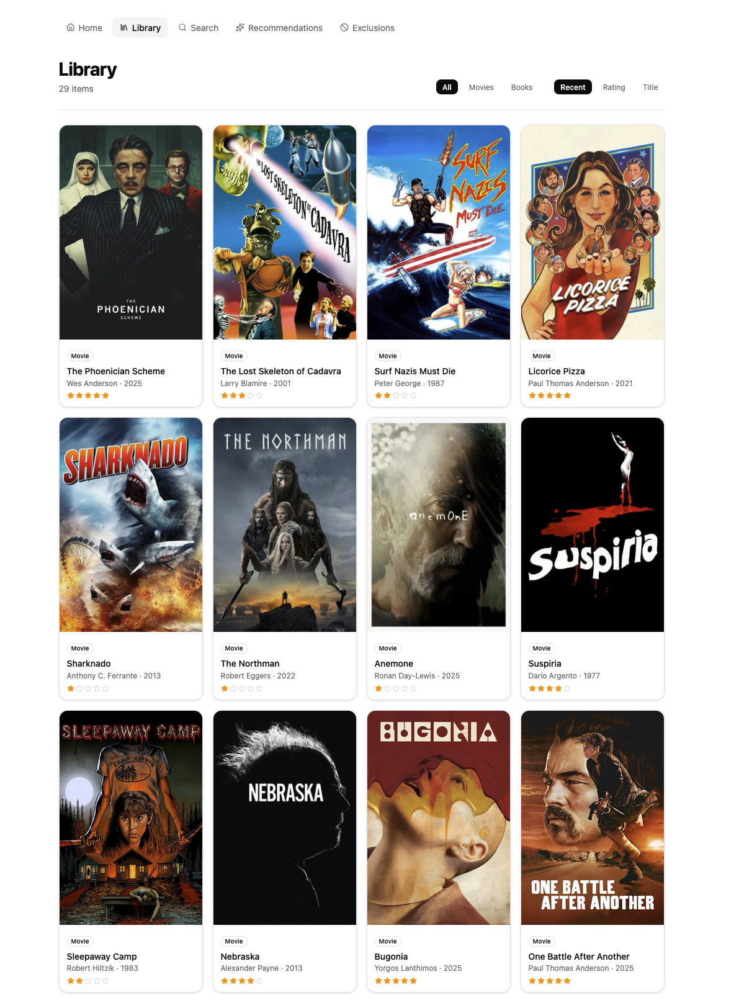
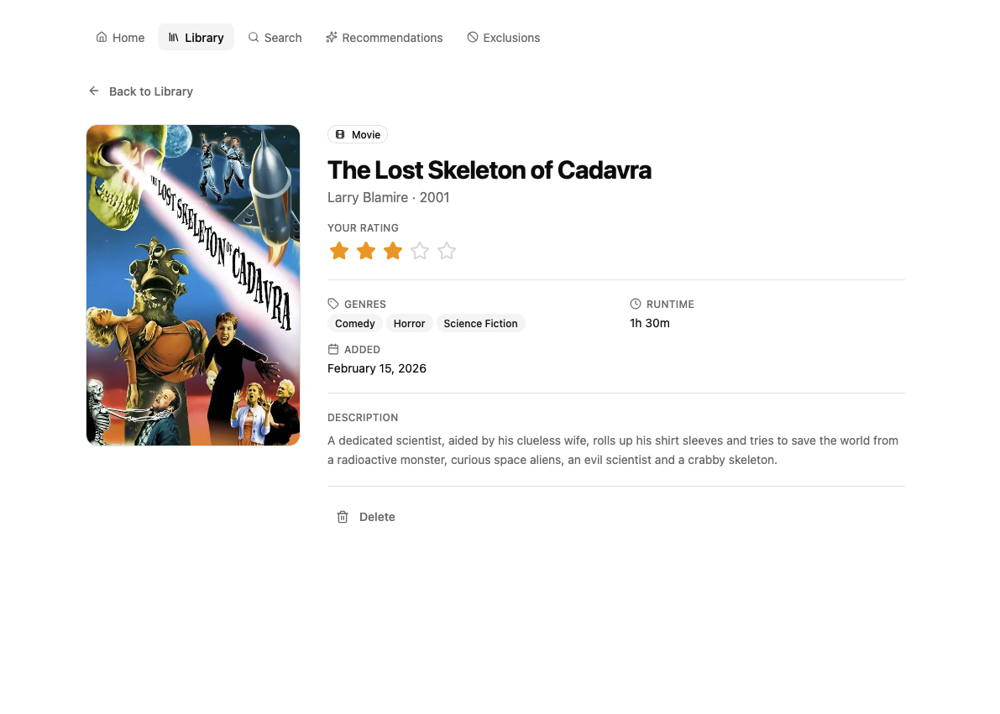
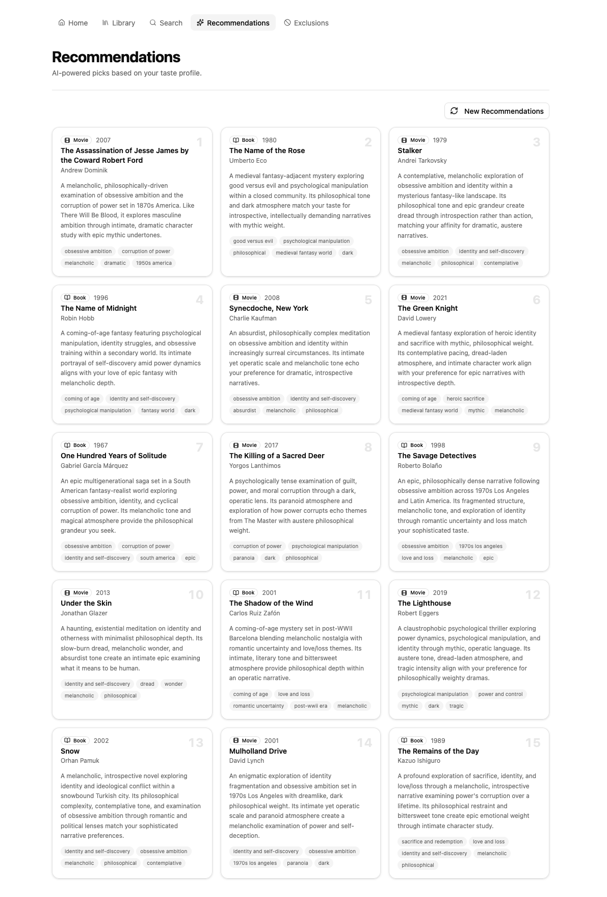
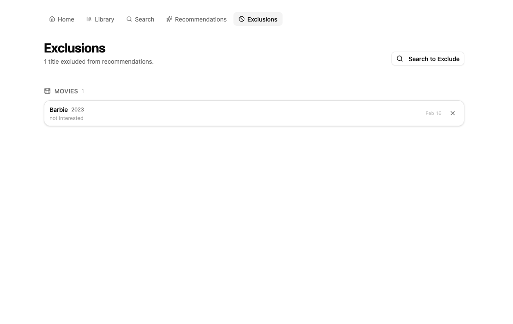

# Turborecs — Web (Frontend)

The Turborecs web app is the UI for an AI-powered personal media recommendation engine. It lets you build a library of movies/books, rate them, generate a taste profile from those signals, and then browse recommendations tailored to that profile.

> This folder contains the **frontend** only. It expects a running Turborecs API and DB.

---

## Screenshots


| Home / Taste Profile | Library |
| --- | --- |
|  |  |

| Media Details | Search |
| --- | --- |
|  |  |

| Recommendations | Exclusions |
| --- | --- |
|  |  |

---

## What you can do

### Dashboard
- See quick stats (Movies, Books, Tags, Recommended)
- Jump into core flows: **Library**, **Search**, **Recommendations**, **Exclusions**
- Inspect your **Taste Profile** (themes/moods/tones/settings) built from ratings + AI-generated tags

### Library
- Browse your logged items in a cover-first grid
- Filter between **All / Movies / Books**
- Sort by **Recent / Rating / Title**
- Open any item for details + management

### Media Details
- View basic metadata (title, creator/director, year, runtime)
- See and set **your rating**
- View genre tags + description
- Delete the item from your library (and remove its influence on your profile)

### Search
- Search for **Movies** or **Books**
- Add a result to your library
- Exclude a title so it never appears in recommendations

### Recommendations
- Generate movie and book recommendations based on your stored taste profile
- Recommendations are saved for 30 days or you can regenerate new ones at will

### Exclusions
- Explicitly exclude certain titles from ever being recommended to you
- View a library-styled inventory of all your excluded titles so you can evolve the media you hate alongside the media you love

---

## Tech stack

- React UI (Next.js-style routing + server/client components and server actions)
- TypeScript
- Utility-first styling (Tailwind or equivalent)
- Turborecs API integration (internal service URL for Docker, public URL for local dev)

---

## Getting started

### Prerequisites
- Node.js (LTS recommended)
- A running Turborecs API / DB (local or Docker)

### Install
```bash
# from the frontend directory (e.g. ./web)
npm install